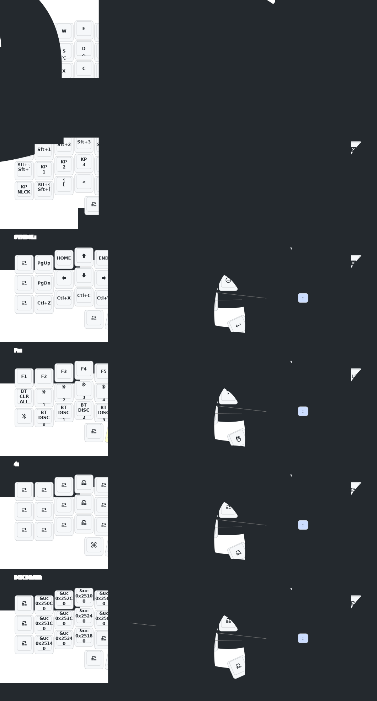

- [English](README_EN.md)

# 睫毛外设 (Eyelash Peripherals) Corne ZMK Repository

**This keyboard is not the same as [foostan's Corne](https://github.com/foostan/crkbd). It will not work with standard `corne` firmware.**

If you need a 3D model of this keyboard, email `380465425@qq.com`.

## Instructions

1. [Fork this repository](https://docs.github.com/en/get-started/quickstart/fork-a-repo#forking-a-repository).
2. [Click the **Actions** tab and make sure the workflow is enabled](https://docs.github.com/en/actions/managing-workflow-runs-and-deployments/managing-workflow-runs/disabling-and-enabling-a-workflow#enabling-a-workflow).
3. Make sure the `eyelash_corne` project in [`config/west.yml`](config/west.yml) still works. The `boards/arm/eyelash_corne` folder will be downloaded from this URL.
4. If there is still a `boards/arm/eyelash_corne` folder in your fork, delete it.

**If you already have a ZMK config repository, [you can add this one as a module instead of forking](https://zmk.dev/docs/features/modules#building-with-modules).**

## BLE Keyboard Display

This repo also builds a firmware feature unrelated to eyelash_corne's specific
hardware: a BLE GATT service (`config/custom_status_screen.c`) that renders
live data (clock, weather, custom text, whole page layouts) on the
keyboard's `nice_view` display, fed by a companion Windows app,
[**zmk-companion**](https://github.com/oscampo/zmk-companion). See that
repo's [user guide](https://github.com/oscampo/zmk-companion/blob/main/docs/user_guide.md)
for what it can do.

**Already have eyelash_corne firmware from this repo?** You already have it:
`build.yaml` enables it (`CONFIG_KBD_BLE_DISPLAY=y`) for the
`eyelash_corne_left` build (the split's central half), so the `.uf2` GitHub
Actions produces for that board already has it. Nothing extra to build.

**Different ZMK board with a `nice_view` display?** The display code has no
eyelash_corne-specific dependencies, it only needs the standard `nice_view`
shield and a split ZMK board (it runs on the central half only). Since this
repo is already usable as a west module (see above), you likely don't need
to fork it or copy any files: add it as a module in your own config's
`west.yml` and build your own board with `-DCONFIG_KBD_BLE_DISPLAY=y`.

This hasn't been verified on a board other than eyelash_corne. If you try it
on a different board, please open an issue (here or on zmk-companion) with
the result either way, working or not, so this note can stop being a guess.

## Your Current Keymap Diagram

